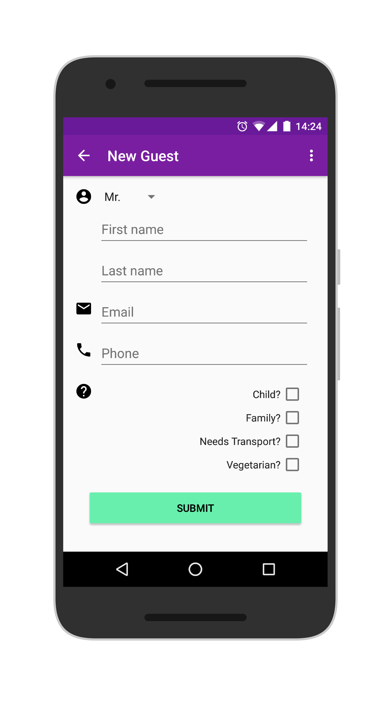

# Wedding Guest List App
So I wanted an app that will help my wife and I organize and manage our guest list for our Wedding.
Decided to write this basic app with Material design.
The app comes with a nice Android Wear Watchface that counts down to the Wedding Date.

We used an online site for people to RSVP so from there I got an excell spreadsheet that I used as initial data.
Imported these records easily into my Firebase Database.

## Screenshots

## Technology / Libraries Used
- [Android Support lib] (https://developer.android.com/topic/libraries/support-library/index.html)
- [Firebase] (https://firebase.google.com/) (Database, Auth)
- [Google Play Services] (https://developers.google.com/android/) (Auth, Places, Location, Wear)
- [Uber Rides Android SDK] (https://github.com/uber/rides-android-sdk)
- [Glide] (https://github.com/bumptech/glide)
- [Butterknife] (https://github.com/JakeWharton/butterknife)
- [CircleImageView] (https://github.com/hdodenhof/CircleImageView)
- [Material Chips] (https://github.com/DoodleScheduling/android-material-chips)
- [RecyclerviewFastScroller] (https://github.com/danoz73/RecyclerViewFastScroller)
- Some code borrowed from Nick Butcher's [Plaid app] (https://github.com/nickbutcher/plaid)

## Installation / Reusing Source code
You will need:
- Your own google-services.json file generated from your [Firebase console] (https://console.firebase.google.com/) 
- Android maps sdk keys
- Uber Rides sdk key
- A list of your admin emails. (The app checks for these, and allows the matching signed in user to Add/Delete guests and organize Tables)

## License

    Copyright 2016 Tinashe Mzondiwa

    Licensed under the Apache License, Version 2.0 (the "License");
    you may not use this file except in compliance with the License.
    You may obtain a copy of the License at

       http://www.apache.org/licenses/LICENSE-2.0

    Unless required by applicable law or agreed to in writing, software
    distributed under the License is distributed on an "AS IS" BASIS,
    WITHOUT WARRANTIES OR CONDITIONS OF ANY KIND, either express or implied.
    See the License for the specific language governing permissions and
    limitations under the License.
